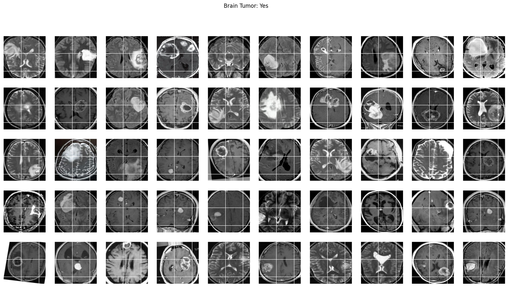

# Brain Tumor MRI for Brain Tumor Classification



## Project Description

This project aims to classify brain tumor images using **deep learning** techniques, specifically through **transfer learning** with the **VGG16** architecture. Leveraging pre-trained models allows us to harness the power of deep learning without requiring vast amounts of training data. This approach enhances our model's accuracy and efficiency, making it suitable for medical image classification tasks.

### Key Features
- **Image Pre-processing**: Images are pre-processed for better model performance, including resizing, normalization, and data augmentation techniques to improve generalization.

- **Train, Validation, and Test Split**: The dataset is split into training, validation, and test sets, ensuring robust evaluation and preventing data leakage.

- **Transfer Learning**: Utilizes the VGG16 model, pre-trained on ImageNet, to extract relevant features from brain tumor images.


## Methodology

1. **Dataset**: A dataset of brain tumor images can be installed from Kaggle [Brain_Tumor_MRI_Classification](https://www.kaggle.com/datasets/navoneel/brain-mri-images-for-brain-tumor-detection/data)
2. **Pre-processing**: 
    - Images are resized to fit the VGG16 input dimensions (224x224 pixels).
    - Normalization is applied to standardize the input data.
    - Data augmentation techniques (rotation, flipping, and shifting) are utilized to create a more diverse training set and prevent overfitting.
3. **Model Architecture**: The VGG16 model is employed with fine-tuning on the top layers to adapt it to the specific task of brain tumor classification.
4. **Training**: The model is trained on the prepared dataset, and performance metrics are monitored.
5. **Evaluation**: The model is evaluated using the validation set to fine-tune hyperparameters and ultimately tested on the test set to assess performance.

## Results 14/10/2024


## Installation

To run this project, please ensure you have the following packages installed:

```bash
pip install -r requirements.txt
```

## Author

**Tariq CHELLALI**

## License

This project is licensed under the **MIT License**. See the [LICENSE](LICENSE) file for details.


## Credit/Citation

- [Chando0185/Advance_Brain_Tumor_Classification](https://github.com/Chando0185/Advance_Brain_Tumor_Classification/blob/main/README.md)
